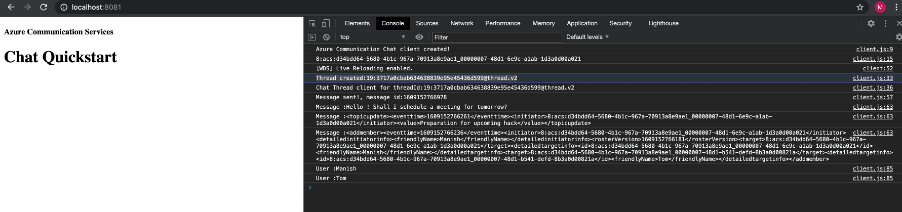

# ACS-JS-blog2-samplecode

## Introduction

## Prerequisites
- Create an Azure account with an active subscription. For details, see [Create an account for free](https://azure.microsoft.com/free/?WT.mc_id=A261C142F).
- [Node.js (12.18.4 and above)](https://nodejs.org/en/download/)
- Create an Azure Communication Services resource. For details, see [Create an Azure Communication Resource](https://docs.microsoft.com/en-us/azure/communication-services/quickstarts/create-communication-resource). You'll need to record your resource **connection string** for this quickstart.

## Code structure
- ./user-mgt/user-mgt.js : 
- ./chat/client.js
- ./deploy : Azure Resource Management Template to create ACS instance
  
## Before running the sample for the first time

1. Open an instance of PowerShell, Windows Terminal, Command Prompt or equivalent and navigate to the directory that you'd like to clone the sample to.
2. `git clone https://github.com/salujamanish/ACS-JS-blog2-samplecode.git`
3. Get the `Connection String` from the Azure portal. For more information on connection strings, see [Create an Azure Communication Resources](https://docs.microsoft.com/en-us/azure/communication-services/quickstarts/create-communication-resource)
4. Once you get the `Connection String`, Set the environment variable with name `COMMUNICATION_SERVICES_CONNECTION_STRING`.

## Local run
1. Open instance of PowerShell, Windows Terminal, Command Prompt or equivalent  and go to the user-mgt folder, run the command `npm install`.
2. Execute following node command from user-mgt folder to run the code `node ./user-mgt.js` run this command twice to create two different users. This shall return userId and Access Token. Save these values for further steps.
3. Set the environment variables `USER1_ID`, `USER2_ID`, `USER_ACCESS_TOKEN` with value received in previous step. Also set the environment variables ` USER1_DISPLAY_NAME` and ` USER2_DISPLAY_NAME` values with any display name of members of the chat.
4. Switch the path from user-mgt to chat folder, run the command `npm install`.
5.Execute following command from chat folder to run the code `npx webpack-dev-server --entry ./client.js --output bundle.js --debug --devtool inline-source-map`.
6. Open your browser and navigate to http://localhost:8080/. In the developer tools console within your browser you should see following:
   

## Additional Reading

- [Azure Communication Chat SDK](https://docs.microsoft.com/en-us/azure/communication-services/concepts/chat/sdk-features) - To learn more about the chat web sdk.
